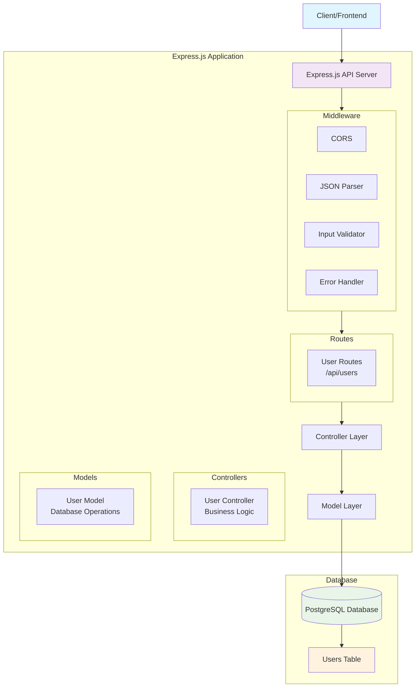

# Express PostgreSQL CRUD API

A RESTful API built with **Express.js** and **PostgreSQL** that provides full CRUD (Create, Read, Update, Delete) operations for user management. This project follows the MVC (Model-View-Controller) architecture pattern and includes input validation, error handling, and database connection management.

## 📋 Table of Contents

- [Features](#features)
- [Architecture Diagram](#architecture-diagram)
- [Project Structure](#project-structure)
- [Technology Stack](#technology-stack)
- [Prerequisites](#prerequisites)
- [Installation](#installation)
- [Environment Variables](#environment-variables)
- [API Endpoints](#api-endpoints)
- [Request/Response Examples](#requestresponse-examples)
- [Database Schema](#database-schema)
- [Error Handling](#error-handling)
- [Contributing](#contributing)
- [License](#license)

## ✨ Features

- **Complete CRUD Operations** - Create, Read, Update, and Delete users
- **Input Validation** - Using Joi schema validation
- **Error Handling** - Centralized error handling middleware
- **Database Connection Pooling** - Efficient PostgreSQL connection management
- **Auto Table Creation** - Automatically creates users table on startup
- **CORS Support** - Cross-Origin Resource Sharing enabled
- **Environment Configuration** - Configurable via environment variables
- **RESTful Design** - Follows REST API conventions

## 🏗️ Architecture Diagram



## 📁 Project Structure

```
Express-Postgres-CRUD-API/
├── src/
│   ├── config/
│   │   └── db.js                 # Database configuration
│   ├── controllers/
│   │   └── userController.js     # User business logic
│   ├── data/
│   │   ├── createUserTable.js    # Database table creation
│   │   └── data.sql              # SQL scripts
│   ├── middlewares/
│   │   ├── errorHandler.js       # Global error handling
│   │   └── inputValidator.js     # Request validation
│   ├── models/
│   │   └── userModel.js          # Database operations
│   ├── routes/
│   │   └── userRoutes.js         # API route definitions
│   └── index.js                  # Application entry point
├── package.json                  # Dependencies and scripts
└── README.md                     # Project documentation
```

## 🛠️ Technology Stack

- **Runtime**: Node.js
- **Framework**: Express.js
- **Database**: PostgreSQL
- **Validation**: Joi
- **Environment**: dotenv
- **Development**: Nodemon
- **CORS**: cors

## 📋 Prerequisites

Before running this application, make sure you have the following installed:

- [Node.js](https://nodejs.org/) (v14 or higher)
- [PostgreSQL](https://www.postgresql.org/) (v12 or higher)
- [npm](https://www.npmjs.com/) or [yarn](https://yarnpkg.com/)

## 🚀 Installation

1. **Clone the repository**

   ```bash
   git clone <repository-url>
   cd Express-Postgres-CRUD-API
   ```

2. **Install dependencies**

   ```bash
   npm install
   ```

3. **Set up environment variables**
   Create a `.env` file in the root directory (see [Environment Variables](#environment-variables))

4. **Start PostgreSQL service**
   Make sure your PostgreSQL service is running

5. **Run the application**

   ```bash
   # Development mode with auto-reload
   npm run dev

   # Production mode
   npm start
   ```

The server will start on `http://localhost:3001` (or the port specified in your environment variables).

## 🔧 Environment Variables

Create a `.env` file in the root directory with the following variables:

```env
# Server Configuration
PORT=3001

# Database Configuration
DB_HOST=localhost
DB_PORT=5432
DB_NAME=your_database_name
DB_USER=your_username
DB_PASSWORD=your_password
```

### Environment Variables Description

| Variable      | Description                        | Default   |
| ------------- | ---------------------------------- | --------- |
| `PORT`        | Port number for the Express server | 3001      |
| `DB_HOST`     | PostgreSQL host address            | localhost |
| `DB_PORT`     | PostgreSQL port number             | 5432      |
| `DB_NAME`     | Name of your PostgreSQL database   | -         |
| `DB_USER`     | PostgreSQL username                | -         |
| `DB_PASSWORD` | PostgreSQL password                | -         |

## 🔗 API Endpoints

### Base URL

```
http://localhost:3001/api
```

### User Endpoints

| Method   | Endpoint     | Description              | Body Required |
| -------- | ------------ | ------------------------ | ------------- |
| `GET`    | `/`          | Test database connection | No            |
| `POST`   | `/users`     | Create a new user        | Yes           |
| `GET`    | `/users`     | Get all users            | No            |
| `GET`    | `/users/:id` | Get user by ID           | No            |
| `PUT`    | `/users/:id` | Update user by ID        | Yes           |
| `DELETE` | `/users/:id` | Delete user by ID        | No            |

## 📝 Request/Response Examples

### 1. Create User

**POST** `/api/users`

**Request Body:**

```json
{
  "name": "John Doe",
  "email": "john.doe@example.com"
}
```

**Response:**

```json
{
  "status": 201,
  "message": "User created successfully",
  "data": {
    "id": 1,
    "name": "John Doe",
    "email": "john.doe@example.com",
    "created_at": "2025-06-10T12:00:00.000Z"
  }
}
```

### 2. Get All Users

**GET** `/api/users`

**Response:**

```json
{
  "status": 200,
  "message": "Users retrieved successfully",
  "data": [
    {
      "id": 1,
      "name": "John Doe",
      "email": "john.doe@example.com",
      "created_at": "2025-06-10T12:00:00.000Z"
    },
    {
      "id": 2,
      "name": "Jane Smith",
      "email": "jane.smith@example.com",
      "created_at": "2025-06-10T12:30:00.000Z"
    }
  ]
}
```

### 3. Get User by ID

**GET** `/api/users/1`

**Response:**

```json
{
  "status": 200,
  "message": "User retrieved successfully",
  "data": {
    "id": 1,
    "name": "John Doe",
    "email": "john.doe@example.com",
    "created_at": "2025-06-10T12:00:00.000Z"
  }
}
```

### 4. Update User

**PUT** `/api/users/1`

**Request Body:**

```json
{
  "name": "John Updated",
  "email": "john.updated@example.com"
}
```

**Response:**

```json
{
  "status": 200,
  "message": "User updated successfully",
  "data": {
    "id": 1,
    "name": "John Updated",
    "email": "john.updated@example.com",
    "created_at": "2025-06-10T12:00:00.000Z"
  }
}
```

### 5. Delete User

**DELETE** `/api/users/1`

**Response:**

```json
{
  "status": 200,
  "message": "User deleted successfully",
  "data": {
    "id": 1,
    "name": "John Updated",
    "email": "john.updated@example.com",
    "created_at": "2025-06-10T12:00:00.000Z"
  }
}
```

### 6. Test Database Connection

**GET** `/`

**Response:**

```json
"The Database Name is your_database_name"
```

## 🗄️ Database Schema

### Users Table

The application automatically creates a `users` table with the following structure:

```sql
CREATE TABLE IF NOT EXISTS users (
    id SERIAL PRIMARY KEY,
    name VARCHAR(100) NOT NULL,
    email VARCHAR(100) UNIQUE NOT NULL,
    created_at TIMESTAMP DEFAULT NOW()
);
```

| Column       | Type         | Constraints      | Description               |
| ------------ | ------------ | ---------------- | ------------------------- |
| `id`         | SERIAL       | PRIMARY KEY      | Auto-incrementing user ID |
| `name`       | VARCHAR(100) | NOT NULL         | User's full name          |
| `email`      | VARCHAR(100) | UNIQUE, NOT NULL | User's email address      |
| `created_at` | TIMESTAMP    | DEFAULT NOW()    | Record creation timestamp |

## ⚠️ Error Handling

The API includes comprehensive error handling:

### Validation Errors

```json
{
  "status": "400",
  "message": "Bad Request",
  "error": "\"name\" length must be at least 3 characters long"
}
```

### Not Found Errors

```json
{
  "status": 404,
  "message": "User not found"
}
```

### Server Errors

```json
{
  "status": 500,
  "message": "Internal Server Error",
  "error": "Database connection failed"
}
```

### Input Validation Rules

- **name**: Required, string, minimum 3 characters, maximum 80 characters
- **email**: Required, valid email format

## 🧪 Testing the API

You can test the API using tools like:

- **Postman**: Import the endpoints and test each operation
- **curl**: Use command line to test endpoints
- **Thunder Client**: VS Code extension for API testing

### Example curl commands:

```bash
# Create a user
curl -X POST http://localhost:3001/api/users \
  -H "Content-Type: application/json" \
  -d '{"name":"John Doe","email":"john@example.com"}'

# Get all users
curl -X GET http://localhost:3001/api/users

# Get user by ID
curl -X GET http://localhost:3001/api/users/1

# Update user
curl -X PUT http://localhost:3001/api/users/1 \
  -H "Content-Type: application/json" \
  -d '{"name":"John Updated","email":"john.updated@example.com"}'

# Delete user
curl -X DELETE http://localhost:3001/api/users/1
```

## 🤝 Contributing

1. Fork the project
2. Create your feature branch (`git checkout -b feature/AmazingFeature`)
3. Commit your changes (`git commit -m 'Add some AmazingFeature'`)
4. Push to the branch (`git push origin feature/AmazingFeature`)
5. Open a Pull Request

## 📄 License

This project is licensed under the ISC License.

## 🔮 Future Enhancements

- [ ] Add user authentication and authorization
- [ ] Implement pagination for user listing
- [ ] Add user profile picture upload
- [ ] Implement email verification
- [ ] Add API rate limiting
- [ ] Create comprehensive test suite
- [ ] Add API documentation with Swagger
- [ ] Implement logging with Winston
- [ ] Add Docker containerization
- [ ] Set up CI/CD pipeline

## 📞 Support

If you have any questions or need help with setup, please create an issue in the repository.

---

**Happy Coding! 🚀**
